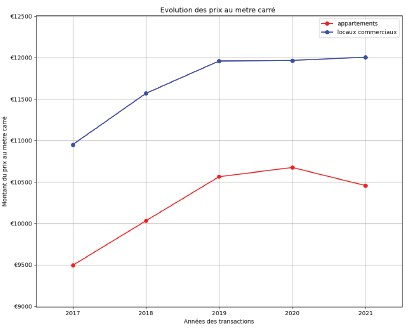

# François Duez

## Business Intelligence Analyst

Bienvenue sur mon portfolio.

## Carte mentale du portfolio
Cette **[carte mentale](Portfolio_mindMap.png)** présente l’organisation globale du portfolio, les compétences mobilisées, les projets réalisés ainsi que les principaux livrables associés au cahier des charges Aéroworld.

## Parcours
Ancien actuaire et professeur de mathématiques, j’ai choisi de me réorienter vers la Business Intelligence afin de retrouver un environnement centré sur l’analyse, la compréhension métier et l’aide à la décision.

Au cours de ma formation OpenClassrooms BI Analyst, j’ai développé des compétences en visualisation de données, modélisation, analyse prédictive, reporting et gestion de projet data à travers plusieurs cas concrets mêlant problématiques techniques et enjeux business.

Mon parcours m’a également permis de développer une forte capacité d’adaptation et de vulgarisation grâce à des expériences variées, notamment dans l’enseignement. Cette approche me permet aujourd’hui de faire le lien entre besoins métiers, contraintes techniques et compréhension utilisateur.

Je souhaite évoluer vers un rôle de consultant BI polyvalent capable :
- d’analyser une problématique métier
- de structurer les besoins
- de transformer des données complexes en informations exploitables
- d’accompagner les utilisateurs dans la prise en main des outils décisionnels

Ce portfolio présente plusieurs projets réalisés durant ma formation ainsi qu’une réflexion sur les compétences techniques, méthodologiques et humaines mobilisées dans un contexte de projet data.

Au-delà des compétences techniques, j’accorde une importance particulière à la compréhension des besoins métiers et à la capacité de proposer des solutions adaptées aux utilisateurs et aux enjeux de l’entreprise.

Mes projets ont été construits avec une approche orientée décision :
- identification des problématiques
- structuration des données
- choix des indicateurs pertinents
- restitution claire des résultats
- accompagnement utilisateur et documentation

Cette démarche s’inscrit dans une logique de conseil où l’objectif n’est pas uniquement de produire des visualisations ou des analyses, mais de fournir des outils réellement exploitables pour la prise de décision.

## Projets principaux
#### Projet 1 : créer un tableau de bord dynamique avec PowerBI pour visualiser l'avancement de projets

**Compétences mobilisées**

*Créer un tableau de bord interactif pour rendre la visualisation disponible et accessible*

*Optimiser une solution de visualisation accessible, adaptée au public et au type de donnée*

*Produire un reporting en analysant les visualisations pour faciliter les décisions*

*Proposer un récit des résultats avec des procédés narratifs pour dynamiser la présentation*

Dashboard Power BI

#### Projet 2 : réaliser une analyse de données en Python
**Analyse des prix de l'immobilier parisien et de leur évolution entre 2017 et 2021** 

**Compétences mobilisées**

*Analyse exploratoire*

*Corrélations*

*Régression prédictive*

*Machine Learning*

  <strong>Evolution des prix des appartements et locaux commerciaux</strong>
   
  

  🔗 <a href="Duez_François_1_Notebook_022026.ipynb">
    <strong>  
    Voir l'analyse Python complète
    </strong>
  </a>

#### Projet 3 : analyser une demande business et identifiez les segments du marché les plus pertinents pour votre client*

**Compétences mobilisées**
*Analyser les données d'un segment clientèle ou produits pour accompagner les décideurs
Analyser les évolutions du marché pour repérer des segments pertinents
Cadrer les contours de la demande en BI en identifiant besoins, contraintes et exigences
Participer à l'élaboration des recommandations business en prenant en compte les besoins*

[Analyse business & segmentation](Duez_Fran%C3%A7ois_1_Pr%C3%A9sentation_042026.pptx)

## Contact
- LinkedIn
- GitHub
